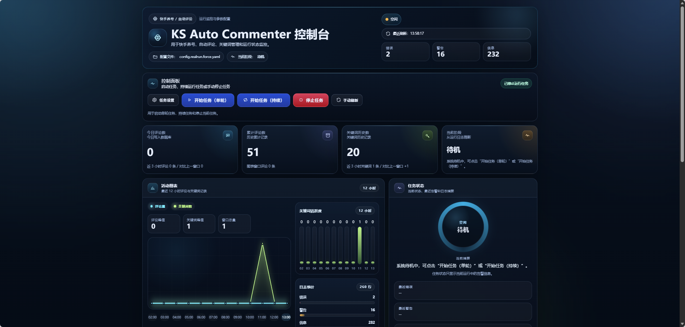
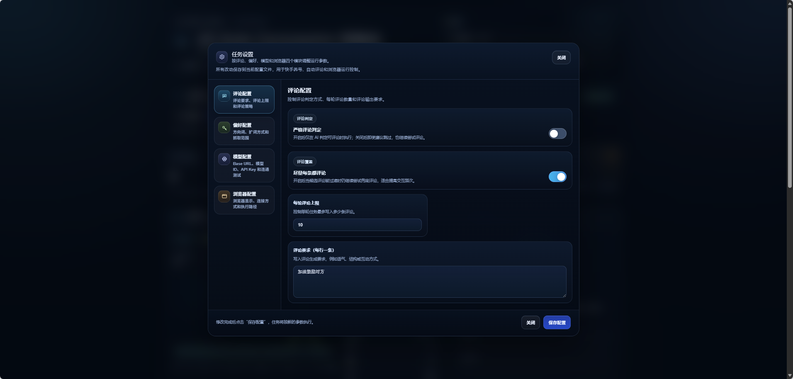
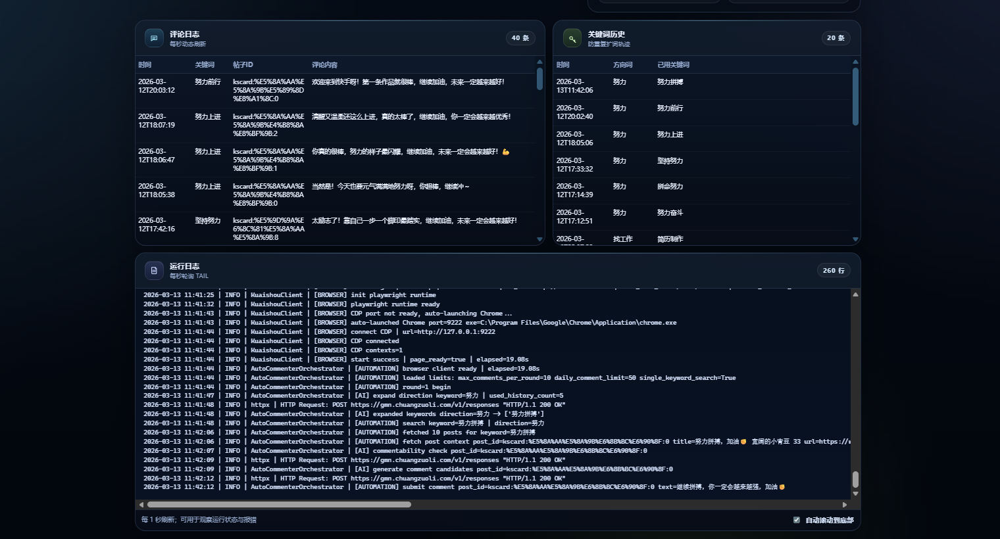

# KwaiGrow Assistant

一个面向 `快手自动养号 / 自动评论 / 运行监控` 的本地化工具。

项目基于 `Python + Playwright + Flask + OpenAI-compatible API + SQLite`，把关键词探索、帖子检索、评论生成、评论发送、去重记录和可视化控制台放在一套流程里，适合做可控节奏下的互动运营。

## 功能截图

### 控制台首页



### 任务设置弹窗



### 运行日志与监控



## 当前功能

- 关键词扩展：按方向词生成搜索关键词，也支持关闭扩词后直接搜索。
- 快手帖子检索：按关键词抓取帖子，支持控制每词抓取数量。
- 评论判定与生成：基于规则和模型生成评论候选，并支持严格判定。
- 自动发送评论：进入帖子、生成评论、提交评论并做结果确认。
- 去重与限流：按帖子 ID / URL / 标题哈希去重，支持每轮上限和每日上限。
- 控制台监控：支持开始单轮任务、开始持续任务、停止任务、查看评论日志、关键词历史和运行日志。
- 设置弹窗：把运行参数拆分为 `评论配置 / 偏好配置 / 模型配置 / 浏览器配置` 四个 Tab。
- 模型连接测试：可在控制台直接测试 Base URL、模型 ID、API Key 是否可用。
- 当前运行告警：任务状态只显示本次运行里的错误、警告和摘要，不再保留几天前的旧告警。

## 快手自动养号 / 评论的核心优势

- 节奏可控：可限制每轮评论数、每日评论数、关键词数量和轮次等待时间，避免过快操作。
- 过程可回溯：评论日志、关键词历史、运行日志和 SQLite 记录都能回看。
- 行为更稳定：支持手动登录、可视浏览器、关键词去重、评论去重和失败重试。
- 监控更直接：控制台可实时看到任务状态、图表、日志统计和最新运行摘要。
- 调整成本低：大部分运行参数可以直接在控制台设置弹窗里修改，不必反复手改 YAML。

## 技术栈

- 后端与 CLI：`Python 3.11`
- 浏览器自动化：`Playwright`、`Chromium / Chrome CDP`
- 控制台：`Flask`、`Jinja2`、`Vanilla JavaScript`、`HTML/CSS`
- 模型接入：`OpenAI-compatible API`
- 配置管理：`YAML`、`PyYAML`
- 数据存储：`SQLite`

## 项目结构

```text
ks-ai-auto-commenter/
├─ main.py                          # CLI 主入口
├─ dashboard.py                     # 控制台入口
├─ src/app/
│  ├─ main.py                       # 程序启动与参数解析
│  ├─ orchestrator.py               # 核心流程编排
│  ├─ dashboard.py                  # Flask 控制台 + API
│  ├─ config.py                     # 配置模型与加载
│  ├─ ai/
│  │  ├─ openai_client.py           # 模型请求封装
│  │  ├─ keyword_expander.py        # 扩词逻辑
│  │  └─ comment_engine.py          # 评论判定/生成/筛选
│  ├─ browser/
│  │  └─ kuaishou_client.py         # 快手页面自动化
│  └─ storage/dedup_store.py        # SQLite 去重与记录
├─ config/
│  ├─ selectors/kuaishou.yaml       # 选择器配置
│  └─ kuaishou.yaml.example         # 示例配置
├─ docs/                            # README 截图与补充文档
├─ logs/                            # 本地运行日志（不提交）
├─ data/                            # 本地数据库与浏览器数据（不提交）
└─ CLAUDE.md                        # 本地协作说明（不提交）
```

> 当前主要运行路径是 `src/app/`；根目录下的 `main.py` 和 `dashboard.py` 是便捷启动入口。

## 快速开始

### 1. 安装依赖

```bash
cd ks-ai-auto-commenter
uv venv .venv
source .venv/bin/activate
uv pip install -r requirements.txt
python -m playwright install chromium
```

Windows PowerShell 可替换为：

```powershell
.\.venv\Scripts\Activate.ps1
pip install -r requirements.txt
python -m playwright install chromium
```

### 2. 准备本地配置

推荐从示例配置复制一份本地运行文件：

```bash
cp config.example.yaml config.realrun.local.yaml
```

或者：

```bash
cp config/kuaishou.yaml.example config.realrun.local.yaml
```

至少需要确认这些字段：

- `openai.base_url`
- `openai.api_key`
- `openai.model_id`
- `topics.direction_keywords`
- `comment_rules.requirements`
- `runtime.max_comments_per_round`
- `runtime.search_limit_per_keyword`

### 3. 启动控制台

```bash
source .venv/bin/activate
python dashboard.py --config ./config.realrun.local.yaml --host 127.0.0.1 --port 8091
```

浏览器访问：`http://127.0.0.1:8091`

### 4. 命令行单轮运行

```bash
source .venv/bin/activate
python main.py --config ./config.realrun.local.yaml --once
```

## 运行前的重要操作

首次使用或更换浏览器环境时，建议按下面顺序执行：

1. 在控制台设置里开启“显示浏览器窗口”。
2. 启动任务后，等待程序自动拉起浏览器。
3. 在程序打开的浏览器里手动登录快手账号。
4. 程序进入视频页后，手动把“连播 / 自动连播”按钮关闭。
5. 确认页面状态正常后，再继续让程序执行评论流程。

如果不先登录，或视频页仍处于连播状态，运行过程可能会被页面自动切换打断。

## 控制台说明

- `任务设置`：弹窗配置评论、偏好、模型、浏览器参数。
- `活动图表`：查看最近 12 小时评论与关键词变化。
- `任务状态`：查看本次运行的状态、摘要、最近错误/警告/信息。
- `评论日志`：查看最近写入数据库的评论记录。
- `关键词历史`：查看已使用的方向词与关键词轨迹。
- `运行日志`：查看实时 tail 日志，便于排查失败原因。

## 免责声明

本项目仅用于技术学习与合规运营自动化实践。请遵守平台规则、法律法规及账号使用规范。
